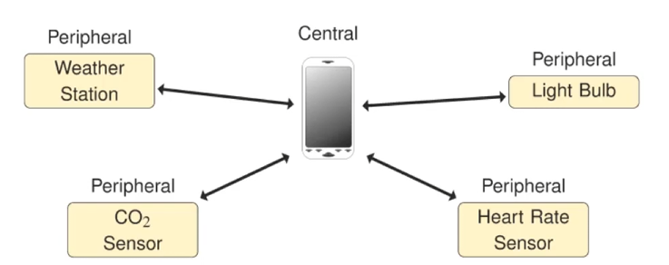
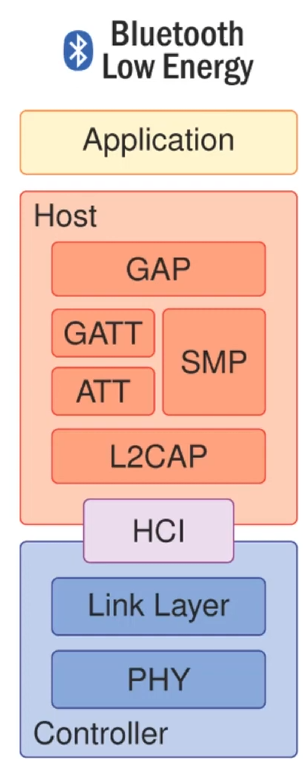
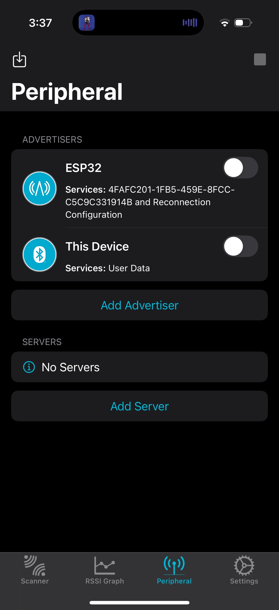
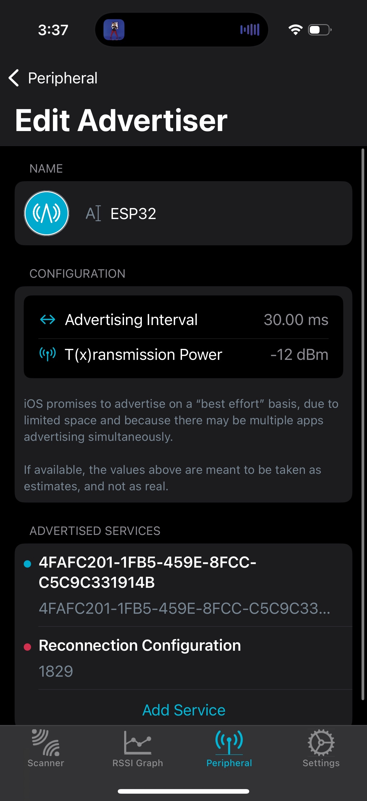
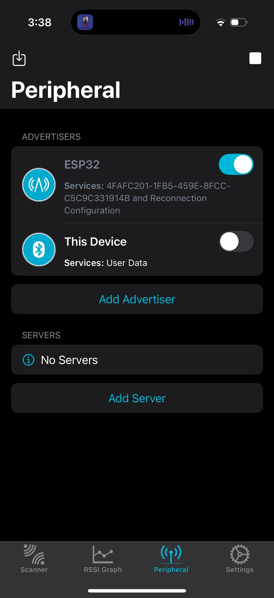
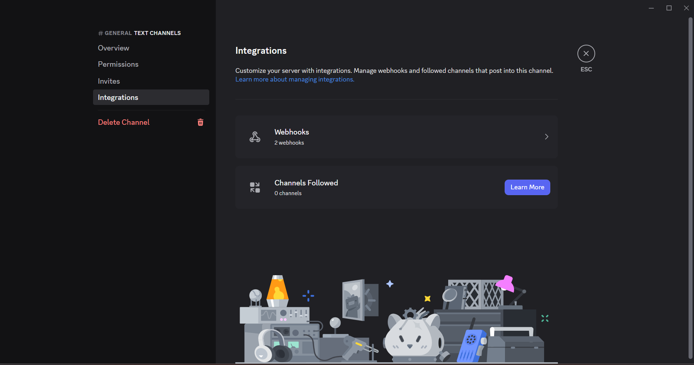
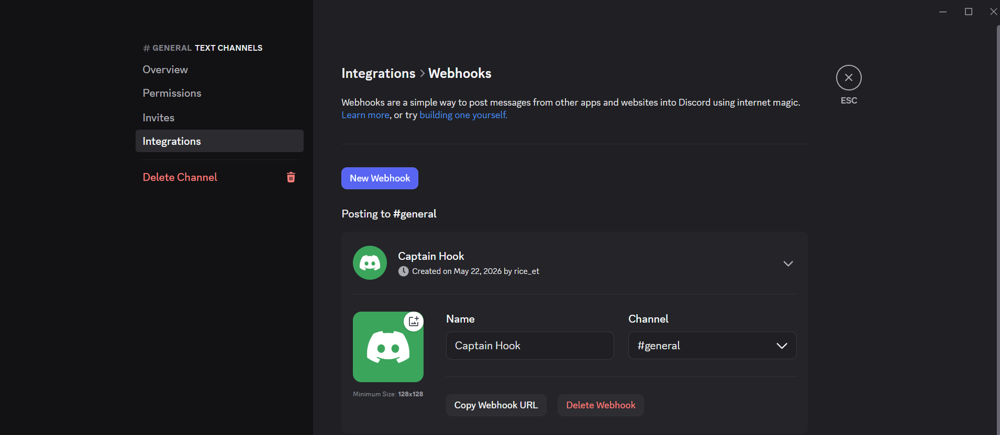
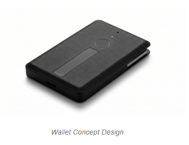
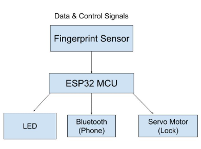

# BLE-Based Proximity Alert System using ESP32
# By: Erictuan Nong
## Abstract
This tutorial demonstrates how to implement a Bluetooth Low Energy (BLE) based proximity alert system using an ESP32 Dev Board integrated with a mobile application. The implementation covers embedded systems programming. This tutorial builds upon prior ESP32 mini projects by extending BLE communication into a practical application.

---

## Intro Concept / Theory

Wireless communication works by transmitting information through electromagnetic waves that travel through the air. Different wireless technologies operate at different frequencies depending on factors such as range, data rate, interference, and power consumption. Bluetooth Low Energy (BLE) operates in the 2.4 GHz Industrial, Scientific, and Medical (ISM) band, which is commonly used because it is globally available and supports reliable short range communication with relatively low power requirements. BLE is designed specifically for devices that need to exchange small amounts of data efficiently while conserving battery life.

In this project, BLE communication will be implemented using the Generic Attribute Profile (GATT) protocol. GATT organizes data into services and characteristics, allowing the system to transmit real time sensor status updates and alert notifications between devices. Below is an image showing the role of GATT in different BLE applications.


From the block diagram:



Below GATT, the BLE protocol stack including Host Controller Interface, Link Layer, and Physical Layer handle device discovery, connection management, and wireless transmission over the 2.4GHz band.

---

## Primary Teaching Section:

### 1a — Enable Personal Hotspot
- Go to **Settings → Personal Hotspot**
- Turn on **"Allow Others to Join"**
- Note your hotspot name and password
### 1b — Set Up nRF Connect Advertiser
1. Download **nRF Connect** on your phone
2. Open the app and tap the **Peripheral** tab
3. Tap **Add Advertiser**
   
4. Name it **ESP32**
5. Tap **Add Service** and enter UUID:
   ```
   4FAFC201-1FB5-459E-8FCC-C5C9C331914B
   ```
   (It's important to note that this is just a random UUID and you can use any UUID if you have one in mind).
  
6. Go back to the Peripheral screen and toggle the advertiser **ON**
  
7. Keep nRF Connect open while using the SmartWallet system
---
## Step 2: Discord Webhook Setup
 
1. Create a Discord server and channel for alerts
   
2. Go to **Channel Settings → Integrations → Webhooks → New Webhook**
   
3. Copy the Webhook URL (format: `https://discord.com/api/webhooks/xxx/yyy`)
   
4 (Optional). Enable Discord notifications on your phone for instant alerts
---

## Step 3: Arduino IDE Setup
 
### 3a — Install ESP32 Board Support
- Follow the tutorial in Mini Project #2 to see how to setup ESP32S3 Devboard in Arduino IDE.
---
 
## Step 4: Project Files
 
Create a new sketch with two files:
 
### `secrets.h`
```cpp
#define WIFI_SSID "YourHotspotName"
#define WIFI_PASS "YourHotspotPassword"
#define DISCORD_WEBHOOK "https://discord.com/api/webhooks/XXX/YYY"
#define ALERT_COOLDOWN_SECONDS X
```
### `sketch.ino`
```cpp
#include <WiFi.h>
#include <HTTPClient.h>
#include <WiFiClientSecure.h>
#include <BLEDevice.h>
#include <BLEScan.h>
#include <BLEAdvertisedDevice.h>
#include "secrets.h"
 
// RSSI threshold — tune for desired distance
// -55 ≈ 2m | -65 ≈ 5m | -75 ≈ 10m | -85 ≈ 20m
#define RSSI_THRESHOLD -65
#define MISSED_SCANS_BEFORE_ALERT 3
 
BLEScan* pBLEScan;
int missedScans = 0;
bool isMissing = false;
unsigned long lastAlertTime = 0;
int lastRSSI = -999;
 
BLEUUID targetUUID("4FAFC201-1FB5-459E-8FCC-C5C9C331914B");
 
void connectWiFi() {
  WiFi.disconnect(true);
  delay(1000);
  WiFi.mode(WIFI_STA);
  delay(500);
  WiFi.begin(WIFI_SSID, WIFI_PASS);
  Serial.print("Connecting to hotspot");
  int attempts = 0;
  while (WiFi.status() != WL_CONNECTED && attempts < 40) {
    delay(500);
    Serial.print(".");
    attempts++;
  }
  if (WiFi.status() == WL_CONNECTED) {
    Serial.println("\nWiFi connected!");
  } else {
    Serial.println("\nFailed to connect!");
  }
}
 
void sendDiscordAlert(String message) {
  if (WiFi.status() != WL_CONNECTED) {
    connectWiFi();
  }
  WiFiClientSecure *client = new WiFiClientSecure;
  if (client) {
    client->setInsecure();
    HTTPClient https;
    if (https.begin(*client, String(DISCORD_WEBHOOK))) {
      https.addHeader("Content-Type", "application/json");
      String payload = "{\"embeds\":[{"
        "\"title\":\"🚨 Smart Wallet Alert!\","
        "\"description\":\"" + message + "\","
        "\"color\":16711680"
      "}]}";
      int httpCode = https.POST(payload);
      Serial.print("Discord response: ");
      Serial.println(httpCode);
      https.end();
    }
    delete client;
  }
}
 
class MyAdvertisedDeviceCallbacks : public BLEAdvertisedDeviceCallbacks {
  void onResult(BLEAdvertisedDevice advertisedDevice) {
    if (advertisedDevice.haveServiceUUID()) {
      if (advertisedDevice.isAdvertisingService(targetUUID)) {
        lastRSSI = advertisedDevice.getRSSI();
        Serial.print("Device found! RSSI: ");
        Serial.println(lastRSSI);
      }
    }
  }
};
 
void setup() {
  Serial.begin(115200);
  delay(1000);
  connectWiFi();
  BLEDevice::init("SmartWallet");
  pBLEScan = BLEDevice::getScan();
  pBLEScan->setAdvertisedDeviceCallbacks(new MyAdvertisedDeviceCallbacks());
  pBLEScan->setActiveScan(true);
  pBLEScan->setInterval(100);
  pBLEScan->setWindow(99);
  Serial.println("Smart Wallet ready. Scanning...");
}
 
void loop() {
  lastRSSI = -999;
  Serial.println("--- Scanning ---");
  pBLEScan->start(5, false);
  pBLEScan->clearResults();
 
  if (lastRSSI == -999) {
    missedScans++;
    Serial.print("Device not found. Missed scans: ");
    Serial.println(missedScans);
  } else if (lastRSSI < RSSI_THRESHOLD) {
    missedScans++;
    Serial.print("Device too far! RSSI: ");
    Serial.println(lastRSSI);
  } else {
    missedScans = 0;
    Serial.print("Device in range! RSSI: ");
    Serial.println(lastRSSI);
    if (isMissing) {
      isMissing = false;
      sendDiscordAlert("✅ Your wallet is back within range!");
    }
  }
 
  if (missedScans >= MISSED_SCANS_BEFORE_ALERT && !isMissing) {
    isMissing = true;
    lastAlertTime = millis();
    Serial.println("ALERT: Wallet out of range!");
    sendDiscordAlert("⚠️ Your wallet has moved out of range!");
  }
 
  if (isMissing) {
    unsigned long elapsed = (millis() - lastAlertTime) / 1000;
    if (elapsed >= ALERT_COOLDOWN_SECONDS) {
      lastAlertTime = millis();
      sendDiscordAlert("⚠️ Still missing! Wallet still out of range.");
    }
  }
 
  delay(2000);
}
```
 
---
 
## Step 5: Distance Calibration
 
RSSI is not perfectly linear but this guide helps tune the threshold:
 
| Distance | Typical RSSI |
|----------|-------------|
| 1m       | -40 to -50  |
| 2m       | -50 to -60  |
| 5m       | -60 to -70  |
| 10m      | -70 to -80  |
| 20m      | -80 to -90  |
---
 
## Troubleshooting
 
| Problem | Fix |
|---------|-----|
| Won't connect to hotspot | Check SSID/password in secrets.h, ensure hotspot is on |
| Device not found | Make sure nRF Connect advertiser is toggled ON |
| Discord response -1 | Check WiFi connection, verify webhook URL |
| Discord response 204 | ✅ Success! |
| False alerts indoors | Raise RSSI threshold (e.g. -60 instead of -65) |
| Upload fails — port busy | Close Serial Monitor before uploading |
 
---


## Final Project Integration

This BLE implementation is directly used in the SmartWallet final project as we need a way for the user's phone to be notified that their wallet was stolen from a signal the wallet sends.

- Motion detection triggers a BLE alert notification
- Multiple BLE characteristics allow separation of data types:
  - Characteristic 1 → security alerts
  - Characteristic 2 → system status



Then once a mobile app is actually implemented, we will want it to have its own feature set for receiving BLE alerts and monitoring wallet status based on notifications it receives.

Here is a link to our final project: https://akrew10.github.io/ECE196_Fingerprint_Wallet/
## Additional Resources

The following resources were used to support the development and understanding of Bluetooth Low Energy (BLE) concepts and implementation for this project:

- https://www.youtube.com/watch?v=GnRRutaqE5s  
  - This video helped with the theory section. You'll find the diagrams in here.

- https://www.espboards.dev/blog/send-message-from-esp32-to-discord/
  - This blog goes over all the steps on how to send messages from your esp32 board to discord.
