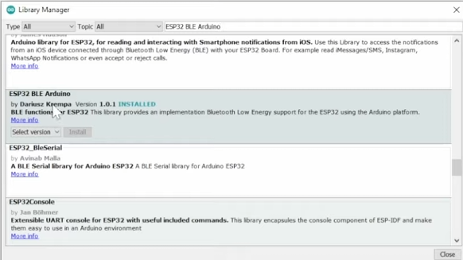
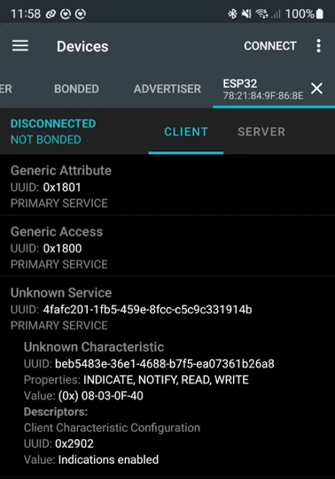
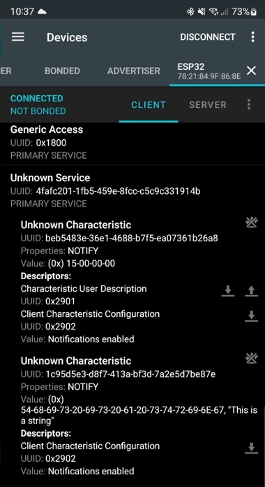

# BLE-Based Proximity Alert System using ESP32

## Abstract
This tutorial demonstrates how to implement a Bluetooth Low Energy (BLE) based proximity alert system using an ESP32 Dev Board integrated with a mobile application. The implementation covers embedded systems programming. This tutorial builds upon prior ESP32 mini projects by extending BLE communication into a practical application.

---

## Intro Concept / Theory

Bluetooth Low Energy (BLE) operates in the 2.4 GHz band and enables short range wireless communication between devices while maintaining low power consumption. In this project we will implement this through the Generic Attribute Profile (GATT) protocol. This allows the system to transmit real time status/alert notifications based on the sensors. Below is an attached image of the importance of GATT in different applications.


From the block diagram:


Below GATT, the BLE protocol stack including Host Controller Interface, Link Layer, and Physical Layer handle device discovery, connection management, and wireless transmission over the 2.4GHz band.

---

## Primary Teaching Section:

### Step 1: Hardware Setup
- ESP32 Dev Board (BLE-enabled)
- Power source (5V Battery)
- Buzzer for alert

Ensure ESP32 is properly connected and recognized in Arduino IDE or PlatformIO. (Mini Project #2 goes over this)

---

### Step 2: ESP32 BLE Server Setup

1. Install BLE library (if using Arduino IDE):
   - `ESP32 BLE Arduino`



2. Define BLE server and characteristics:
   - Create a BLE server on ESP32
   - Define a characteristic for sending status updates
```cpp
// Create the BLE Device
BLEDevice::init("ESP32");

// Create the BLE Server
pServer = BLEDevice::createServer();

// Attach connection callbacks (optional but part of server behavior)
pServer->setCallbacks(new MyServerCallbacks());
```
```cpp
// Create the BLE Service
BLEService *pService = pServer->createService(SERVICE_UUID);

// Create a BLE Characteristic for sending status updates
pCharacteristic = pService->createCharacteristic(
                    CHARACTERISTIC_UUID,
                    BLECharacteristic::PROPERTY_NOTIFY
                  );
```
```cpp
// Add descriptor to enable notifications
pBLE2902 = new BLE2902();
pBLE2902->setNotifications(true);
pCharacteristic->addDescriptor(pBLE2902);
```
```cpp
// Start the service
pService->start();

// Start advertising
BLEAdvertising *pAdvertising = BLEDevice::getAdvertising();
pAdvertising->addServiceUUID(SERVICE_UUID);

BLEDevice::startAdvertising();
```
- Now send status updates
```cpp
if (deviceConnected) {
    pCharacteristic->setValue(value);
    pCharacteristic->notify();
    value++;
    delay(1000);
}
```

- You should see something like this:


---

### Step 3: BLE Client–Server Communication
- ESP32 acts as the BLE Server.
- Client scans for the services.

This establishes a channel for sending alerts and status updates.

#### ESP32 BLE Server

The ESP32 advertises a BLE service and sends notifications to the connected mobile device.

---

#### 1. BLE Server Setup with Callback Handling

```cpp
BLEServer* pServer = NULL;
bool deviceConnected = false;

class MyServerCallbacks: public BLEServerCallbacks {
    void onConnect(BLEServer* pServer) {
      deviceConnected = true;
    }

    void onDisconnect(BLEServer* pServer) {
      deviceConnected = false;
    }
};
```

#### 2. Create Multiple Characteristics
```cpp
#define CHARACTERISTIC_UUID_1 "beb5483e-36e1-4688-b7f5-ea07361b26a8"
#define CHARACTERISTIC_UUID_2 "1c95d5e3-d8f7-413a-bf3d-7a2e5d7be87e"
BLEService *pService = pServer->createService(SERVICE_UUID);

BLECharacteristic* pCharacteristic_1 =
    pService->createCharacteristic(
        CHARACTERISTIC_UUID_1,
        BLECharacteristic::PROPERTY_NOTIFY
    );

BLECharacteristic* pCharacteristic_2 =
    pService->createCharacteristic(
        CHARACTERISTIC_UUID_2,
        BLECharacteristic::PROPERTY_READ |
        BLECharacteristic::PROPERTY_WRITE |
        BLECharacteristic::PROPERTY_NOTIFY
    );
```

- You should see something like this:


---

## Final Project Integration

This BLE implementation is directly used in the SmartWallet final project as we need a way for the user's phone to be notified that their wallet was stolen from a signal the wallet sends.

- Motion detection triggers a BLE alert notification
- Multiple BLE characteristics allow separation of data types:
  - Characteristic 1 → security alerts
  - Characteristic 2 → system status


Then once a mobile app is actually implemented, we will want it to have its own feature set for receiving BLE alerts and monitoring wallet status based on notifications it receives.

Here is a link to our final project: https://akrew10.github.io/ECE196_Fingerprint_Wallet/
## Additional Resources

The following resources were used to support the development and understanding of Bluetooth Low Energy (BLE) concepts and implementation for this project:

- https://www.youtube.com/watch?v=GnRRutaqE5s  
  This video helped with the theory section. You'll find the diagrams in here.

- https://www.youtube.com/watch?v=0Yvd_k0hbVs&list=PL94tI_1M51VWwqCMGSpFWTzUbsezOPoJ4  
  This is a 5-part tutorial series which helped in actually creating the primary teaching section.
  However part 4 and 5 go into creating the mobile app which I don't think this specific assignment should necessarily go over yet.
